<style type ="text/css">
.remark-slide-content {
  font-size: 95%;
  padding: 1em 2em 1em 2em;
}
</style>

<style>
.remark-code, .remark-inline-code { font-family: 'Source Code Pro', 'Lucida Console', Monaco, monospace;
                                    font-size: 85%;
                                  }
</style>
```{r setup, include=FALSE}
options(htmltools.dir.version = FALSE)

# read in datasets
# structures      <- readRDS("data/structures.rds")
# counties_shp    <- readRDS("data/counties_shp.rds")
# stagevol        <- readRDS("data/stagevol.rds")
# county_totals   <- readRDS("data/county_totals.rds")
# endpoints       <- readRDS("data/endpoint_tbl.rds")
aoi  <- sf::read_sf("data/california_polygon.gpkg")
# sb <- sf::read_sf("data/santa_barbara_polygon.gpkg")
# catchments <- sf::read_sf("data/catchments.gpkg")
flowlines <- sf::read_sf("data/flowlines.gpkg")
# outlets <- sf::read_sf("data/outlets.gpkg")
flowlines_raster <- raster::raster("data/flowlines_raster.tif")
catalog <- climateR::params 
# texas <- sf::read_sf("data/texas_polygon.gpkg")
gulf_coast <- sf::read_sf("data/gulfcoast_polygon.gpkg")
# texas <- AOI::aoi_get(state = "Texas")
# gulf_coast <- AOI::aoi_get(state = c("Texas", "Louisiana", "Mississippi", "Alabama", "Florida"))
# sf::write_sf(texas, "data/texas_polygon.gpkg")
# sf::write_sf(gulf_coast, "data/gulfcoast_polygon.gpkg")
library(dplyr)
library(knitr)
library(kableExtra)
library(fontawesome)
library(DT)
library(ggplot2)
```

```{r, eval = F, echo = F}
# gulf_coast <- sf::read_sf("data/gulfcoast_polygon.gpkg")
# harv <- climateR::getGridMET(
#   AOI = gulf_coast,
#   varname = "pr",
#   startDate = "2017-08-12",
#   endDate = "2017-09-10"
# )
# library(terra)
# 
# rr <- harv$precipitation_amount
# # tx_mask <- 
# #   rr %>% 
# #   terra::mask(texas)
# # plot(rr$`pr_2017-08-15`)
# # library(tidyterra)
# # for terra::nlyr(tx_mask)
# for (i in 1:terra::nlyr(rr)) {
# 
#   message("i" , i)
#   hr <- 
#     ggplot2::ggplot() +
#     tidyterra::geom_spatraster(data =   rr[[i]]) +
#     ggplot2::geom_sf(data = gulf_coast, fill = "transparent", color = "red", lwd = 1) + 
#     # viridis::scale_fill_viridis(discrete = FALSE) + 
#     tidyterra::scale_fill_wiki_c() + 
#     ggplot2::theme_void() +
#     ggplot2::theme(legend.position  = "none")
#     
#   ggplot2::ggsave(
#     hr, 
#     filename = paste0("D:/harvey/", ifelse(i > 9, paste0(i), paste0("0", i)),  "_harvey.png"),
#     height = 10,
#     width = 16,
#     scale = 1
#   )
# }
# 
# # ifelse(i > 9, paste0(i), paste0("0", i))
# harvey_paths = list.files("D:/harvey/", full.names = T)
# sort(harvey_paths)
# gifski::gifski(sort(harvey_paths), gif_file = "gif/hurricane_harvey.gif", width = 1900, height = 1300, delay = 0.75)
# # ggplot2::ggplot() +
# #   tidyterra::geom_spatraster(data = tx_mask$`pr_2017-08-15`) +
# #   # viridis::scale_fill_viridis(discrete = FALSE) + 
# #   tidyterra::scale_fill_wiki_c() + 
# #   ggplot2::theme_void() +
# #   ggplot2::theme(legend.position  = "none")
# plot(harv$precipitation_amount$`pr_2017-08-15`)google
```

---
class: center, middle

# climatePy

---

# Today's libraries

```{python, eval = T, echo = T}
import climatePy

import pandas as pd
import numpy as np

import geopandas as gpd
import xarray as xr
import datetime
import matplotlib.pyplot as plt
```

---

# Types of climate data ?
------------------------------------

Climate Data is a common data source used in applications across human and physical geography. For our purposes, climate data can have up to **5 dimensions**:

--

.pull-left-50[

- 1D: timeseries

]

--

.pull-left-50[

- 2D: grid

]

--

.pull-left-50[

- 3D: XY grid w/ time

]

--

.pull-left-50[

- 4D: XYT cube w/ multiple variables (wind, rain)

]


--

.pull-left-50[


- 5D: XYT cube w/ multiple variables + models
]

--

```{r, echo = FALSE, out.width="60%", out.height="60%", fig.align = "center"}
# {r, echo = FALSE, out.width="95%", out.height="95%", fig.align = "center"}
knitr::include_graphics("img/climatedata_dims.png")
```

--

---
# Outline of slides
------------------------------------

## Topics to be covered today: 

--

1. What is Raster data model?

--

2. Finding and using climate data ***(the hard way)***

--

3. Finding and using climate data ***(the easy way)***

--

4. Some simple applications and operations that can be applied to climate data

--

```{r, eval = FALSE, echo = FALSE}
# # # CODE FOR GETTING AOI SHAPES
# library(AOI)
# 
# sb <- AOI::aoi_get(county = "Santa Barbara", state = "CA")
# sb2 <- AOI::aoi_get("Santa Barbara")
# ucsb <- AOI::aoi_get("UCSB")
# sb_mp <- rmapshaper::ms_explode(sb) %>%
#   dplyr::mutate(
#     area = sf::st_area(geometry),
#     island = ifelse(area == max(area), 0, 1)
#   ) %>%
#   dplyr::select(county = name, state_name, state =state_abbr, area, island, geometry) %>%
#   dplyr::arrange(-area) %>%
#   dplyr::slice(1) %>% 
#   dplyr::select(state, county, geometry)
# 
# # 
# sf::write_sf(sb, "data/santa_barbara_county_polygon.gpkg")
# sf::write_sf(sb2, "data/santa_barbara_city_polygon.gpkg")
# # sf::write_sf(sb_mp, "data/santa_barbara_polygon.gpkg")
# sf::write_sf(sb_mp, "data/santa_barbara_polygon.gpkg")
# sf::write_sf(ucsb, "data/ucsb_polygon.gpkg")
# mapview::mapview(sb) + ucsb + sb2
```

---

# 1. Types of GeoSpatial Data 
------------------------------------

Geographic data is typically stored in 2 ways


1. **rasters** (gridded format)

--

2. **vectors** (object format)

<br>

```{r echo=FALSE, out.width="55%", fig.align='center'}
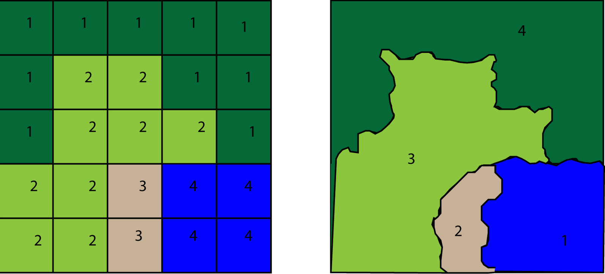
```


---

# What are rasters?
------------------------------------
### Rasters = Grids/matrices +  **Coordinate reference system (CRS)**: 

--

- Rasters = Grids/matrices +  **Coordinate reference system (CRS)**

--

  - Basically rasters are lists of lists/matrices or lists of matrices with extra metadata attached.

--

`r fa("arrow-right",  height = "1em", margin_left = "1em", margin_right = "1em")`  The go to python libraries for gridded spatial data are `rasterio` and `xarray`

<br>

--

```{r echo=FALSE, out.width="60%", fig.align='center'}
# 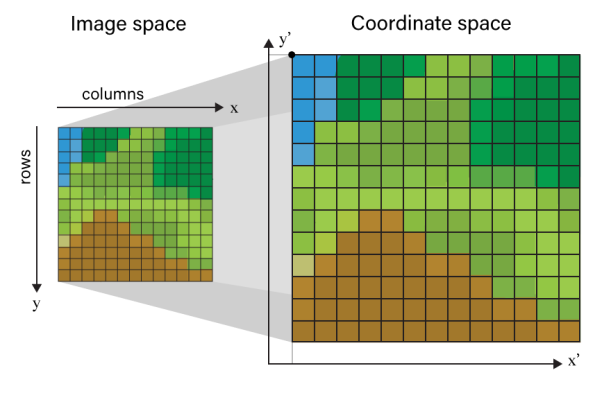

```

--

---

# What is in a raster?
------------------------------------
Rasters are defined by 6 key pieces of info:

--

- Values

--

- An extent (min X, min Y, max X, max Y)

--

- Cell Resolution

--

- Number of cells in the X and Y directions

--

- Spatial Reference System

--

```{r echo=FALSE, out.width="45%", fig.align='center'}
# 
# out.extra='style="background-color: #9ecff7; padding:10px; display: inline-block;"'
knitr::include_graphics("img/raster_data_pieces.png")
```

--

---

# What is vector data?
------------------------------------
Vector data can be `points`, `lines`, and `polygons`


#### vector data = **nodes** + **edges**

--

.pull-left-65[
- Points
]

.pull-right-35[

```{r echo=FALSE, out.width="15%", fig.align='center'}
# 
knitr::include_graphics("https://gisgeography.com/wp-content/uploads/2015/09/points-vector.png")
```

]

--

.pull-left-65[
- Lines
]

.pull-right-35[

```{r echo=FALSE, out.width="15%", fig.align='center'}
# 
knitr::include_graphics("https://gisgeography.com/wp-content/uploads/2015/09/line-vector.png")
```

]

--

.pull-left-65[
- Polygons
]

.pull-right-35[

```{r echo=FALSE, out.width="15%", fig.align='center'}
# 
knitr::include_graphics("https://gisgeography.com/wp-content/uploads/2015/09/polygon-vector.png")
```

]

--
---

# Going back and forth
------------------------------------

Vector data can be represented as a raster and vice versa

--

<center>
```{r, eval = T, echo = FALSE}
mapview::mapview(flowlines) + flowlines_raster
```
</center>

---

# Side note
------------------------------------

--

<br>
<br>

<center>
<blockquote style="font-size: 36px;">AOI = "Area of Interest" </blockquote>
</center>

---

# The landscape of climate data
------------------------------------

--

- Multi-dimensional cubes covering large domains, over long times period, with many variables, and possibly ensembles

--

- **HUGE** Data (often terabytes to petabytes)

--

- ***Rarely*** do we need ALL the data across ALL TIME:

--

<br>

To reduce the size we can:

--

- Use raster utilities like `mask` or `crop` on in memory data **(memory limited)**

--

- Call specific pieces of data from `local files` (e.g. with gdal) **(disk limited)**

--

- Call specific pieces of data from `remote files` (OPeNDAP) **(internet limited)**

--

---

# Cookie cutter pattern 
------------------------------------

Very common workflow with spatial data analysis:

--
#### **Step 1:**  Pick an Area of Interest (AOI)  `r fa("magnifying-glass-location",  height = "1.5em", margin_left = "1em")` 

--

#### **Step 2:**  Get gridded data for an area larger than your AOI `r fa("filter", height = "1.5em", margin_left = "1em")` 

--

#### **Step 3:**  Punch a hole in the raster with your vector data like a cookie cutter `r fa("chart-line", height = "1.5em", margin_left = "1em")` 

<br>

--

```{r echo=FALSE, out.width="45%", fig.align='center'}

```

# Into the weeds we go....
------------------------------------

Lets walk through an example of doing this the *hard* way

<br>

```{r echo=FALSE, out.width="80%", fig.align='center'}
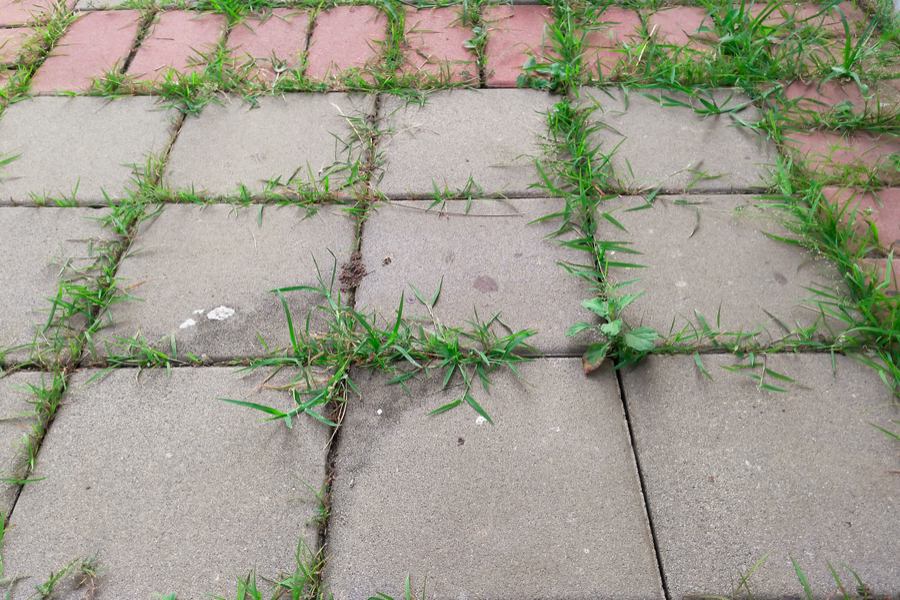
```

---

# The hard way
------------------------------------

<br>
<br>
<br>

<center>
<blockquote style="font-size: 22px;">I want to get precipitation data for Santa Barbara, CA on January 9, 2018 ...</blockquote>
</center>

---

# Choosing an AOI (Area of Interest)
------------------------------------

`Geopandas` is the go-to library for representing geospatial **vector** (object) data in Python:

--

```{python, echo = TRUE, eval = TRUE}
# read in a Polygon of California as a GeopandasDataframe
aoi = gpd.read_file("data/california_polygon.gpkg")
```

--

```{python, echo = FALSE, eval = TRUE}
aoi
```

<br>

```{r echo=FALSE, out.width="55%", fig.align='center'}
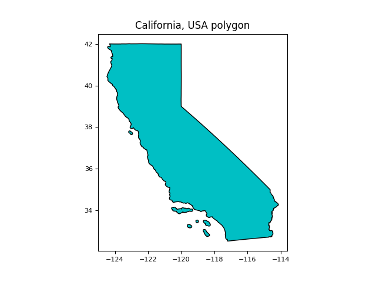
```

```{python, eval = F, echo = FALSE}
# import matplotlib.pyplot as plt

fill_color = '#F8766D'
fill_color = '#00BFC4'
outline_color = 'black'
plt.figure(figsize=(14, 10))  # Adjust the width and height as desired
# Plot the GeoDataFrame with custom colors
aoi.plot(facecolor=fill_color, edgecolor=outline_color)

# Add a title to the plot
plt.title("California, USA polygon")
plt.gca().set_xlabel('')
plt.gca().set_ylabel('')
plt.tick_params(axis='x', labelsize=8)
plt.tick_params(axis='y', labelsize=8)
plt.set_xticks(xbreaks)
plt.savefig('./img/california_polygon.png')
plt.show()
```

---

# Make our cookie cutter ...
------------------------------------

--

.pull-left[
get the extent of AOI
```{python}
extent = aoi.bounds
extent
```
]

--

.pull-left[
and the CRS 
```{python}
crs = aoi.crs
crs
```
]

--

.pull-left[
```{r echo=FALSE, out.width="85%", fig.align='left'}
# 
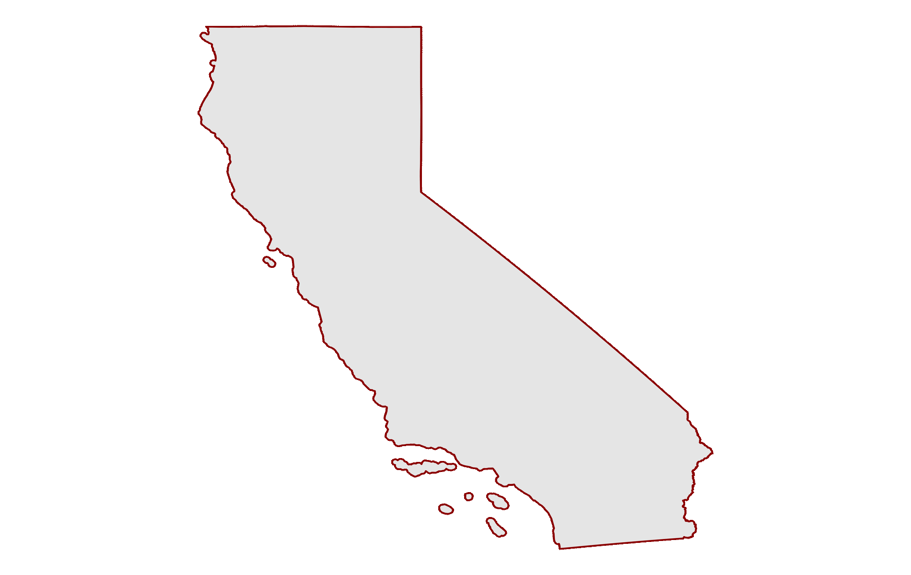
```
]


```{r, eval = F, echo = F}
bbox_plot1 <-
  ggplot2::ggplot() +
  ggplot2::geom_sf(data = aoi, color = "darkred", lwd = 1) +
  # ggplot2::geom_sf(data = sf::st_as_sfc(sf::st_bbox(sb)), fill = "transparent", color = "black", lwd = 2) +
  ggplot2::theme_void()

bbox_plot2 <-
  ggplot2::ggplot() +
  ggplot2::geom_sf(data = aoi, color = "darkred", lwd = 1) +
  ggplot2::geom_sf(data = sf::st_as_sfc(sf::st_bbox(aoi)), fill = "transparent", color = "black", lwd = 2) +
  ggplot2::theme_void()

ggplot2::ggsave(bbox_plot1,
                filename = "img/01_aoi_bbox.png",
                width = 14,
                height = 10,
                scale = 1
                )
ggplot2::ggsave(bbox_plot2,
                filename ="img/02_aoi_bbox.png",
                width = 14,
                height = 10,
                scale = 1
                )
library(gifski)

gifski::gifski(
  png_files = c("img/01_aoi_bbox.png", "img/02_aoi_bbox.png"),
              gif_file = "gif/aoi_bbox.gif",
              width = 1900,
              height = 1200,
              delay = 1,
              loop = TRUE,
              progress = TRUE
              )
plot(sb$geom, border = "darkred", lwd = 2)
plot(sf::st_as_sfc(sf::st_bbox(sb)), add = T, lwd = 3)

# plt.figure(figsize=(18, 12))
# nc.data_vars['precipitation_amount'].isel(day=0).plot()
# plt.legend(loc='lower center')
# plt.savefig("C:/Users/angus/OneDrive/Desktop/github/climatedata_slideshow/img/conus_ex.png", dpi = 300)
# plt.show()
```

---

# Resource Connection ...
------------------------------------

Note: '#fillmismatch' is appended to the call in order forcibly convert the _FillValue value to the type of the variable on DAP calls

--


```{python, eval = T, echo = T}
catalog = "http://thredds.northwestknowledge.net:8080/thredds/dodsC/"
cdm     = "agg_met_pr_1979_CurrentYear_CONUS.nc"
url     = catalog + cdm + "#fillmismatch"

# nc = xr.open_dataset(url)
nc = xr.open_dataset(url,  decode_times=False)
```

--

```{r echo=FALSE, out.width="80%", fig.align='center'}
# 
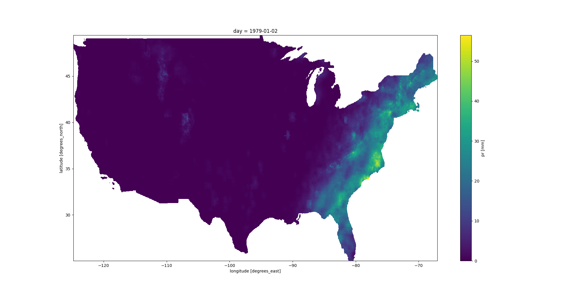
```

```{python, eval = F, echo = F}
# catalog = "http://thredds.northwestknowledge.net:8080/thredds/dodsC/"
# cdm     = "agg_met_pr_1979_CurrentYear_CONUS.nc"
# url     = catalog + cdm + "#fillmismatch"
# nc = xr.open_dataset(url)
# 
# # CONUS RASTER PLOT
# plt.figure(figsize=(20, 10))
# nc['precipitation_amount'].isel(day = 1).plot()
# # plt.tick_params(axis='x', labelsize=8)
# # plt.tick_params(axis='y', labelsize=8)
# plt.savefig('./img/conus_ex.png')
# plt.show()
```

---

# Variable Extraction...
------------------------------------

--

With a connection to a remote resource (object nc), we can extract the X, Y, and T (time) variables to get the dimensions of the entire dataset

-- 

```{python, eval = T, echo = T}
X = nc['lon'].values
Y = nc['lat'].values
time = nc['day'].values
```

--

```{python, eval = T, echo = T}
ncols = len(X)
ncols
```

--

```{python, eval = T, echo = T}
nrows = len(Y)
nrows
```

--

```{python, eval = T, echo = T}
len(time)
```

---

# Index Identification ...
------------------------------------

--

Let's index these dimensions from the  **LARGE** grid to find the position of CA in relation to the *entire dataset*

--
```{python, eval = TRUE, echo = TRUE}
sorted_X = np.sort(X)
sorted_Y = np.sort(Y)

# XY dimensions
xmin = np.argmin(np.abs(sorted_X - extent["minx"][0]))
xmax = np.argmin(np.abs(sorted_X - extent["maxx"][0])) 
ymin = np.argmin(np.abs(sorted_Y - extent["miny"][0])) 
ymax = np.argmin(np.abs(sorted_Y - extent["maxy"][0]))

# time dimension
start_date = datetime.datetime.strptime("1979-01-01", "%Y-%m-%d").date()
end_date = datetime.datetime.strptime("2018-01-09", "%Y-%m-%d").date()

time = end_date - start_date
```

--

.pull-left[
```{python, eval = TRUE, echo = TRUE}
xmin
```
]

--

.pull-left[

```{python, eval = TRUE, echo = TRUE}
xmax
```

]

--

.pull-left[
```{python, eval = TRUE, echo = TRUE}
ymin
```
]

--

.pull-left[
```{python, eval = TRUE, echo = TRUE}
ymax
```
]

--

.pull-left[
```{python, eval = TRUE, echo = TRUE}
time.days
```
]

--

---

# Construct URL and establish connection ...
------------------------------------

```{python, eval = T, echo = T}
url = (catalog + cdm + 
    "?precipitation_amount" + 
    "[" + str(time.days) + ":1:" + str(time.days)  + "]"+ 
    "[" + str(ymin) + ":1:" + str(ymax)  + "]" +
    "[" + str(xmin) + ":1:" +  str(xmax) + "]" + 
    "#fillmismatch"
    )
```

--

Make the connection... 
```{python, eval = T, echo = T}
nc = xr.open_dataarray(url)
```

```{python, eval = F, echo = F}
print(f"Latitude from {nc['lat'].values.min()} to {nc['lat'].values.max()} ?!?!?")
```

--

And check our coordinates...
```{python, eval = T, echo = T}
nc['lat'].values.min(), nc['lat'].values.max()
```

--

Latitude values are between 0 - 228 degrees ?!??!!?!?
```{r echo=FALSE, out.width="25%", fig.align='center'}
# knitr::include_graphics("https://clipground.com/images/latitudes-clipart-3.jpg")
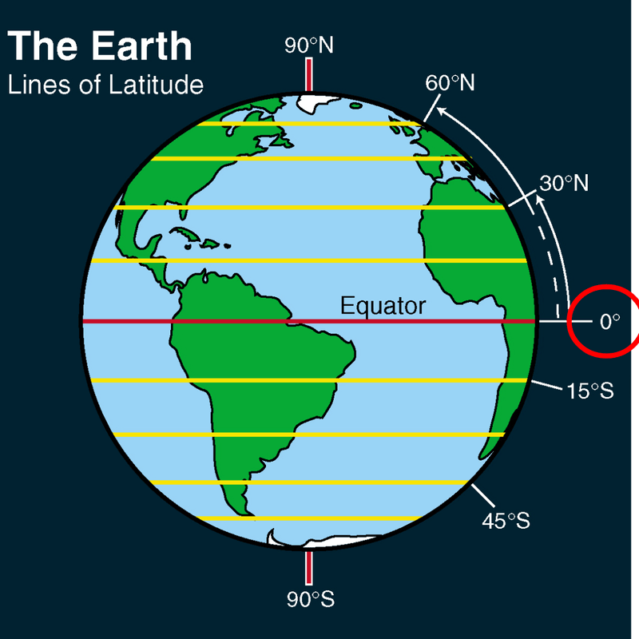
# knitr::include_graphics("https://clipground.com/images/latitudes-clipart-3.jpg")
```

```{r echo=FALSE, eval = FALSE}
# R CODE FOR LATITUDE GIF
# library(gifski)
# 
# gifski::gifski(
#   png_files = c("img/01_lines_latitude.png", "img/02_lines_latitude.png",
#                 "img/03_lines_latitude.png", "img/04_lines_latitude.png",
#                 "img/05_lines_latitude.png", "img/06_lines_latitude.png"
#                 ),
#               gif_file = "gif/lines_of_latitude.gif",
#               width = 800,
#               height = 800,
#               delay = 1,
#               loop = TRUE,
#               progress = TRUE
#               )
# 
# knitr::include_graphics("https://clipground.com/images/latitudes-clipart-3.jpg")
```

---

# is it right?
------------------------------------

--

Coordinates shmooridinates, I just want to see if it rained

--

```{python, eval = F, echo = T}
plt.figure(figsize=(16, 12))  
nc.plot()
plt.show()
```

```{python, eval = F, echo = F}
plt.figure(figsize=(16, 12))  
nc.plot()
# plt.title("California, USA polygon")
# plt.gca().set_xlabel('')
# plt.gca().set_ylabel('')
# plt.tick_params(axis='x', labelsize=8)
# plt.tick_params(axis='y', labelsize=8)
# plt.set_xticks(xbreaks)
plt.savefig('./img/upsidedown_precip.png')
plt.show()
```

```{r echo=FALSE, out.width="55%", fig.align='center'}
# 
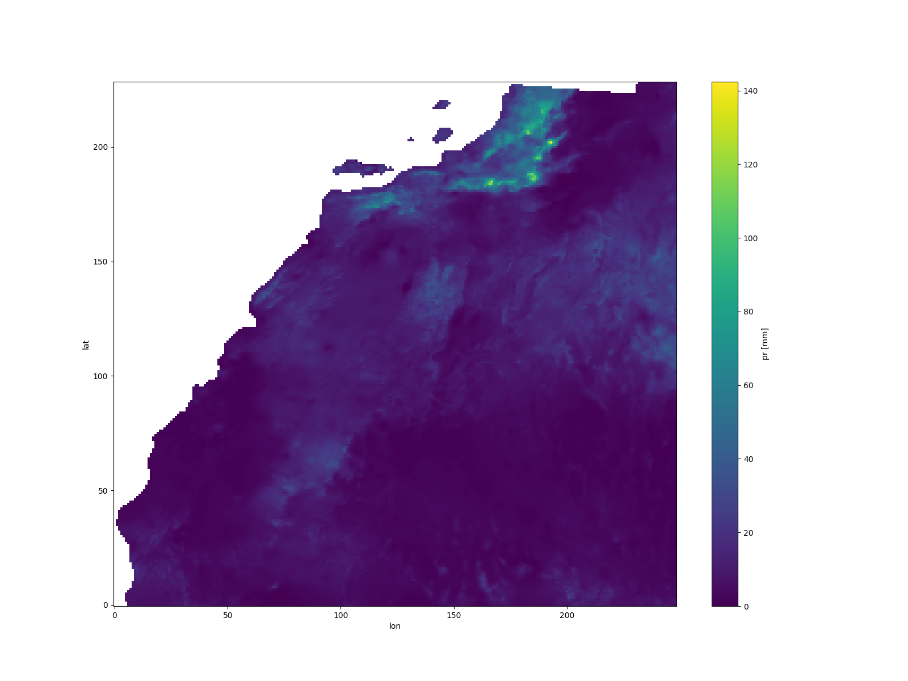
```

--

#### upside down...cool...and wonky XY dimensions...cool...


---

# Get coordinates for AOI...
------------------------------------

**To fix:** 

--

Use original grid values **🠊**
--
 calculate cell resolution **🠊** 
--
 Make new coordinates **🠊** 
--
 subset to AOI **:)**
--

--

.pull-left[
Determine the start/end XY indices of the grid
```{python, eval = T, echo = T}
# Starts/ends of XY grid
X1 = min(X)
Y1 = max(Y)
Xn = max(X)
Yn = min(Y)
```
]

--

.pull-left[
Calculate XY cell resolution
```{python, eval = T, echo = T}
# X resolution
resx = (Xn - X1)/(ncols - 1)

# Y resolution
resy = (Yn - Y1)/(nrows - 1)
```
]

--

<center>
Convert arbitrary grid numbers to actual coordinate values...
</center>

```{python, eval = T, echo = T}
# convert arbitrary grid numbers to coordinates 
xstart = X1 - 0.5 * resx
xend   = Xn + 0.5 * resx
ystart = Y1 - 0.5 * resy
yend   = Yn + 0.5 * resy

dates = pd.date_range(start  = "2018-01-09", end = "2018-01-09", periods = 1)

# subset to coordinates of interest
ycoords = -1*np.linspace(ystart, yend, nrows, endpoint=False)[ymin:ymax+1]
xcoords = np.linspace(xstart, xend, nrows, endpoint=False)[xmin:xmax+1]
```

---

# Make sure we got it right...
------------------------------------

--

Y coordinates
```{python, eval = F, echo = T}
ycoords[0:5]
```

```{python, eval = T, echo = F}
-ycoords[0:5]
```

--

X coordinates
```{python, eval = T, echo = T}
xcoords[0:5]
```

--

Date attribute
```{python, eval = T, echo = T}
dates
```

--

<br>
<br>

<center>
<h3> SUCCESS !</h3>
</center>

---

# Assign coordinates, CRS, and flip data...
------------------------------------

--

.pull-left[
Assign coordinates to our `DataArray` and then flip it over...
```{python, eval = T, echo = T}
r = xr.DataArray(
    nc,
    coords = {
        'day': dates,
        'lat': ycoords,
        'lon': xcoords,
        'crs': crs
    },
    dims=[ 'day', 'lat', 'lon']
    )
    

# flip array
flipped_data = np.flip(r.values, axis=1)

# create new DataArray from flipped array
r = xr.DataArray(
    flipped_data,
    dims   = ('day', 'lat', 'lon'),
    coords = {'day': r.day, 
              'lat': r.lat, 
              'lon': r.lon}
              )

# assign CRS 
r.attrs['crs'] = crs
```
]

<br>
<br>
<br>
<br>
<br>

--

.pull-left[
```{r echo=FALSE, out.width="100%", fig.align='center'}
# 
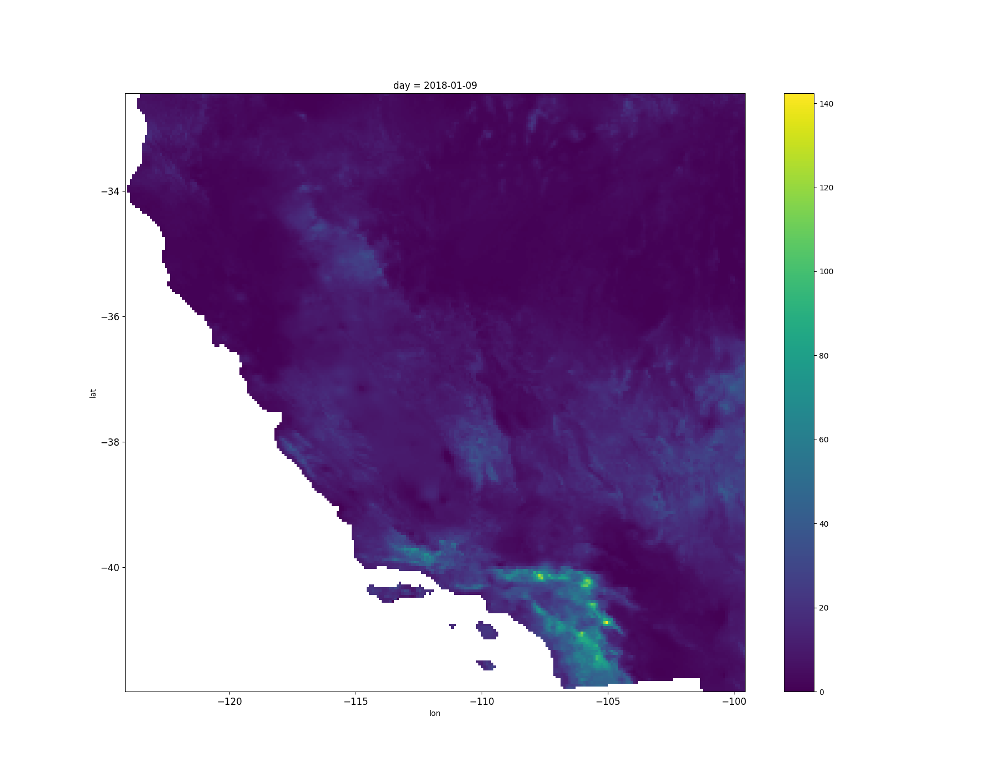
```
]

```{python, eval = F, echo = F}
# FLIPPED RASTER PLOT
plt.figure(figsize=(18, 14))
r.plot()
plt.tick_params(axis='x', labelsize=12)
plt.tick_params(axis='y', labelsize=12)
# plt.savefig('./img/flipped_precip_nocrs.png')
plt.show()
```

---

# so what?
------------------------------------
--

### TAKE HOME POINT:  

--

<br>

<center>
<blockquote style="font-size: 32px;">This was a pain and won't work for every dataset </blockquote>
</center>

--

---

# Wonky time data
------------------------------------

--

- Crazy time intervals
```{r, eval = TRUE, echo = FALSE}
unique(catalog$interval)
```

--

---

# Wonky dimension names/ordering
------------------------------------

Irregular XY dimension names X dimension names 

--

X dimension names:
```{r, eval = TRUE, echo = FALSE}
unique(catalog$Y_name)
```

--

Y dimension names:
```{r, eval = TRUE, echo = FALSE}
unique(catalog$X_name)
```

---

# Many CRSs
------------------------------------
```{r, eval = TRUE, echo = FALSE}
unique(catalog$crs)
```
--

```{r echo=FALSE, out.width="50%", fig.align='center'}
# 
knitr::include_graphics("img/crs_differences.png")
```

-- 

```{r, eval = F, echo = F}
# subparams <- 
#   # params %>% 
#    # climateR::params %>% 
#   catalog %>% 
#   dplyr::filter(id %in% c("maca_day", "maca_month", "gridmet", "terraclim",
#                           "daymet4",   "ISRIC Soil Grids", "NASADEM", "wc2.1_10m", "loca", "polaris")) %>%
#   dplyr::group_by(id) %>% 
#   dplyr::slice(1) %>% 
#   dplyr::ungroup() %>% 
#   dplyr::relocate(URL, .after = last_col())

# time_intervals <- 
#   catalog %>% 
#   dplyr::group_by(interval) %>% 
#   dplyr::slice(1) %>% 
#   dplyr::ungroup() %>% 
#   # dplyr::relocate(URL, .after = last_col()) %>% 
#   dplyr::select(id, asset, varname, variable, description, interval)
# 
# unique(catalog$interval) %>% unique()
# catalog$X_name %>% unique()
# catalog$Y_name %>% unique()

# DT::datatable(
#   # subparams[1:15], 
#   time_intervals,
#   extensions = 'FixedColumns',
#   options = list(
#   dom = 't',
#   scrollX = TRUE,
#   scrollCollapse = TRUE
# ))
```

---

# Easier way?
------------------------------------

--

Drumroll...

<br>
<br>

--

<center>
<blockquote style="font-size: 50px;">climatePy </blockquote>
</center>

---

# Climate catalog
------------------------------------

`climatePy` simplifies the steps needed to get climate data into Python. `climatePy` provides 3 main things:

<br>

--

**I.** A **catalog** of over 100,000k datasets from over 2,000 data providers/archives. See (`climatePy.params()`)

```{python, eval = T, echo = T}
import climatePy

catalog = climatePy.params()
```

--

```{python, eval = T, echo = T}
len(catalog)
```

```{python, eval = T, echo = T}
len(catalog.id.unique())
```

--

**II.** **General toolkit** for accessing remote + local gridded data 

--

**III.** Set of **shortcuts** for implementing methods for a few core catalog data sets

--

---

# Get some data
------------------------------------

Download some that same rain data we tried to get earlier in one swing
--

.pull-left[
```{python, eval = T, echo = T}
rain = climatePy.getGridMET(
  AOI       = aoi, 
  varname   = "pr", 
  startDate = "2018-01-09",
  endDate   = "2018-01-09", 
  dopar     = False
  )
  
rain['pr'].dims
```
]

--

.pull-left[
```{r echo=FALSE, out.width="100%", fig.align='center'}
# 
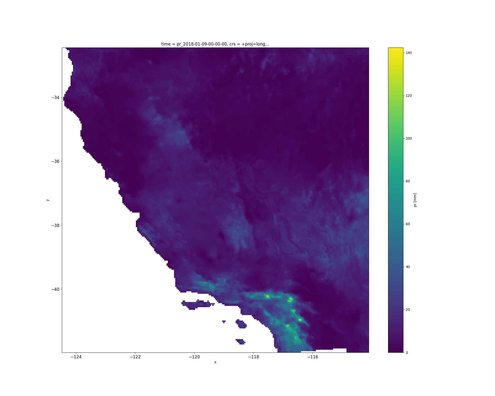
```
]

--

```{python, eval = F, echo = F}
# FLIPPED RASTER PLOT
plt.figure(figsize=(20, 16))
rain['pr'].isel(time = 0).plot()
plt.tick_params(axis='x', labelsize=12)
plt.tick_params(axis='y', labelsize=12)
plt.savefig('./img/single_gridmet_raster.png')
plt.show()
```

---

# 2020 Summer heat wave?
------------------------------------

--

```{python, eval = T, echo = T}
temp = climatePy.getGridMET(
  AOI       = aoi, 
  varname   = "tmmx", 
  startDate = "2020-08-25",
  endDate   = "2020-09-13", 
  dopar     = False
  )
temp['tmmx'].dims
```

```{python, eval = F, echo = F}
# FLIPPED RASTER PLOT
# tmax['tmax'].plot(x="lon", y="lat", col="time", col_wrap=4)

# # xx = temp['tmax'].isel(time=slice(0, 16)).plot(x="x", y="y", col="time", col_wrap=4)
# fig.set_size_inches(20, 14)
# plt.tick_params(left = False, right = False , labelleft = False ,
#                 labelbottom = False, bottom = False)
# plt.title("")
# temp['tmmx'].isel(time=slice(0, 18)).plot(x="x", y="y", col="time", col_wrap=5)
# plt.savefig(f'img/ca_heatwave.png')
# plt.show()
```

---

# 2020 Summer heat wave?

------------------------------------

--

```{r echo=FALSE, out.width="85%", fig.align='center'}
# 
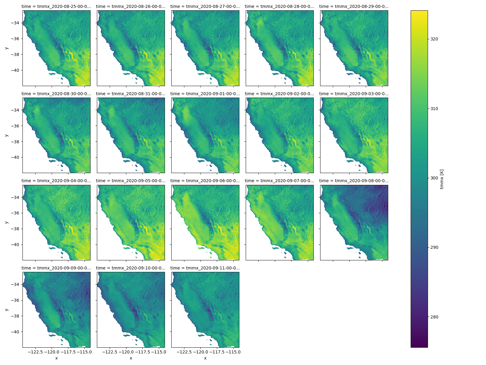
```

---

# Elevation data?

--

```{python, eval = TRUE, echo = TRUE}
sb = gpd.read_file("data/santa_barbara_polygon.gpkg")
sb
```

```{python, eval = F, echo = F}
plt.figure(figsize=(16, 12))
sb.plot()
plt.tick_params(axis='x', labelsize=12)
plt.tick_params(axis='y', labelsize=12)
plt.savefig('./img/sb_polygon.png')
plt.show()
```

--

```{r echo=FALSE, out.width="50%", fig.align='center'}
# 
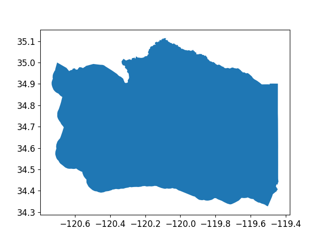
```

```{python, eval = F, echo = F}
# plt.figure(figsize=(16, 12))
# dem['elevation'].plot()
# plt.tick_params(axis='x', labelsize=12)
# plt.tick_params(axis='y', labelsize=12)
# plt.savefig('./img/sb_dem.png')
# plt.show()
```

---

# Elevation data?
------------------------------------

--

Get the elevation of Santa Barbara area
```{python, eval = TRUE, echo = TRUE}
dem = climatePy.get3DEP(
  AOI   = sb,
  dopar = False
)

dem['elevation'].dims
```

---

# Elevation data?
------------------------------------

```{r echo=FALSE, out.width="80%", fig.align='center'}
# 
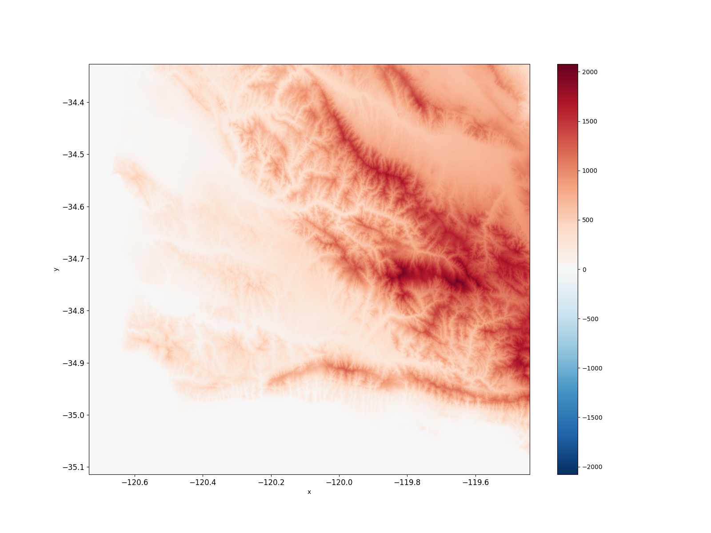
```

---

# Hurricane harvey
------------------------------------
--

```{python, eval = TRUE, echo = TRUE}
gulf_coast = gpd.read_file("data/gulfcoast_polygon.gpkg")
gulf_coast
```

--

```{r echo=FALSE, out.width="55%", fig.align='center'}
# 
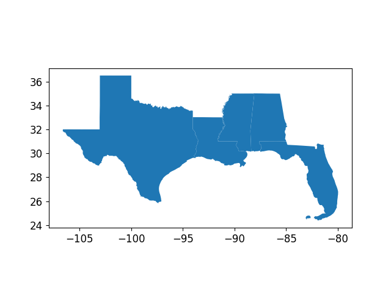
```


```{python, eval = F, echo = F}
# plt.figure(figsize=(16, 12))
# gulf_coast.plot()
# plt.tick_params(axis='x', labelsize=12)
# plt.tick_params(axis='y', labelsize=12)
# plt.savefig('./img/gulf_coast.png')
# plt.show()
```

--

```{python, eval = F, echo = T}
harvey = climatePy.getGridMET(
  AOI       = gulf_coast,
  varname   = "pr",
  startDate = "2017-08-12",
  endDate   = "2017-09-10"
)
```


---

# Hurricane harvey
------------------------------------

--

```{r echo=FALSE, out.width="100%", fig.align='center'}
# 
knitr::include_graphics("gif/hurricane_harvey.gif")
```

--

```{r, eval = F, echo = F, out.height="30%", out.width="50%", fig.align='center'}
# subparams <- 
#   # params %>% 
#    # climateR::params %>% 
#   catalog %>% 
#   dplyr::filter(id %in% c("maca_day", "maca_month", "gridmet", "terraclim",
#                           "daymet4",   "ISRIC Soil Grids", "NASADEM", "wc2.1_10m", "loca", "polaris")) %>%
#   dplyr::group_by(id) %>% 
#   dplyr::slice(1) %>% 
#   dplyr::ungroup() %>% 
#   dplyr::relocate(URL, .after = last_col())
# params$id %>% unique() 
# DT::datatable(subparams,  options = list(scrollX = TRUE))

# DT::datatable(
#   subparams[1:15], 
#   extensions = 'FixedColumns',
#   options = list(
#   dom = 't',
#   scrollX = TRUE,
#   scrollCollapse = TRUE
# ))
# # DT::datatable(subparams[1:100,], fillContainer  = TRUE)
# m = as.data.frame(round(matrix(rnorm(100), 5), 5))
# 
# datatable(
#   m, extensions = 'FixedColumns',
#   options = list(
#   dom = 't',
#   scrollX = TRUE,
#   scrollCollapse = TRUE
# ))

time_intervals <- 
  catalog %>% 
  dplyr::group_by(interval) %>% 
  dplyr::slice(1) %>% 
  dplyr::ungroup() %>% 
  # dplyr::relocate(URL, .after = last_col()) %>% 
  dplyr::select(id, asset, varname, variable, description, interval)

# catalog$interval %>% unique()
# catalog$X_name %>% unique()
# catalog$Y_name %>% unique()
# catalog$crs %>% unique()

# AOI3 = sf::read_sf("D:/climatePy_test_data/single_polygon_nad83.gpkg")
# temp = climateR::getTerraClim(AOI = AOI3,  varname = "tmax", startDate = "2019-01-01", endDate = "2019-03-30" )
# temp %>% terra::time()
# temp$tmax$

DT::datatable(
  # subparams[1:15],
  time_intervals,
  extensions = 'FixedColumns',
  options = list(
  dom = 't',
  scrollX = TRUE,
  scrollCollapse = TRUE
))
```


---

# Conclusion
------------------------------------

--

Geospatial datasets can be messy and a pain to locate/load/organize...

<br>
<br>
<br>

--

## **🠊 climatePy helps abstract away some of that pain**
-+
---

class: center, middle

# Questions?

---
