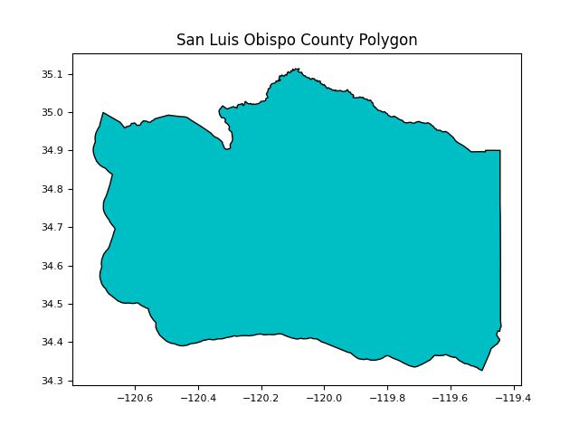

<style type ="text/css">
.remark-slide-content {
  font-size: 95%;
  padding: 1em 2em 1em 2em;
}
</style>

<style>
.remark-code, .remark-inline-code { font-family: 'Source Code Pro', 'Lucida Console', Monaco, monospace;
                                    font-size: 85%;
                                  }
</style>
```{r setup, include=FALSE}
options(htmltools.dir.version = FALSE)

# read in datasets
# structures      <- readRDS("data/structures.rds")
# counties_shp    <- readRDS("data/counties_shp.rds")
# stagevol        <- readRDS("data/stagevol.rds")
# county_totals   <- readRDS("data/county_totals.rds")
# endpoints       <- readRDS("data/endpoint_tbl.rds")
sb <- sf::read_sf("data/santa_barbara_polygon.gpkg")
catchments <- sf::read_sf("data/catchments.gpkg")
flowlines <- sf::read_sf("data/flowlines.gpkg")
outlets <- sf::read_sf("data/outlets.gpkg")
flowlines_raster <- raster::raster("data/flowlines_raster.tif")

library(dplyr)
library(knitr)
library(kableExtra)
library(fontawesome)
```


---
class: center, middle

# climatePy

---

# Types of climate data ?
------------------------------------

Climate Data is a common data source used in applications across human and physical geography. For our purposes, climate data can have up to **5 dimensions**:

--

.pull-left-50[

- 1D: timeseries

]

--

.pull-left-50[

- 2D: grid

]

--

.pull-left-50[

- 3D: XY grid w/ time

]

--

.pull-left-50[

- 4D: XYT cube w/ multiple variables (wind, rain)

]


--

.pull-left-50[


- 5D: XYT cube w/ multiple variables + models
]

--

```{r, echo = FALSE, out.width="60%", out.height="60%", fig.align = "center"}
# {r, echo = FALSE, out.width="95%", out.height="95%", fig.align = "center"}
knitr::include_graphics("img/climatedata_dims.png")
```

--

---
# Outline of slides
------------------------------------

## Topics to be covered today: 

--

1. What is Raster data model?

--

2. Finding and using climate data ***(the hard way)***

--

3. Finding and using climate data ***(the easy way)***

--

4. Some simple applications and operations that can be applied to climate data

--

```{r, eval = FALSE, echo = FALSE}
# # # CODE FOR GETTING AOI SHAPES
# library(AOI)
# 
# sb <- AOI::aoi_get(county = "Santa Barbara", state = "CA")
# sb2 <- AOI::aoi_get("Santa Barbara")
# ucsb <- AOI::aoi_get("UCSB")
# sb_mp <- rmapshaper::ms_explode(sb) %>%
#   dplyr::mutate(
#     area = sf::st_area(geometry),
#     island = ifelse(area == max(area), 0, 1)
#   ) %>%
#   dplyr::select(county = name, state_name, state =state_abbr, area, island, geometry) %>%
#   dplyr::arrange(-area) %>%
#   dplyr::slice(1) %>% 
#   dplyr::select(state, county, geometry)
# 
# # 
# sf::write_sf(sb, "data/santa_barbara_county_polygon.gpkg")
# sf::write_sf(sb2, "data/santa_barbara_city_polygon.gpkg")
# # sf::write_sf(sb_mp, "data/santa_barbara_polygon.gpkg")
# sf::write_sf(sb_mp, "data/santa_barbara_polygon.gpkg")
# sf::write_sf(ucsb, "data/ucsb_polygon.gpkg")
# mapview::mapview(sb) + ucsb + sb2
```

---

# 1. Types of GeoSpatial Data 
------------------------------------

Geographic data is typically stored in 2 ways:

--

- **rasters** (gridded format)

-- 

--

- **vectors** (object format)

--

```{r echo=FALSE, out.width="55%", fig.align='center'}
knitr::include_graphics("img/raster_vs_vector.png")
```

---

# 1. Parts of the raster data model
------------------------------------
### Rasters are: 

--

- Rasters are gridded representation of an area with a **Coordinate reference system (CRS)**

--

- Basically rasters are lists of lists/matrices or lists of matrics with extra metadata attached.

--

#### `r fa("arrow-right",  height = "1em", margin_left = "1em", margin_right = "1em")`  The go to python libraries for gridded spatial data are `rasterio` and/or `xarray`

--

```{r echo=FALSE, out.width="55%", fig.align='center'}
# knitr::include_graphics("img/raster_data_model.png")
knitr::include_graphics("img/xarray_logo.png")
```

--

---
# 6 key components of a raster:

Rasters are defined by 6 key pieces of info:

--
- Values
--
- An extent (min X, min Y, max X, max Y)
--
- Cell Resolution
--
- Number of cells in the X and Y directions
--
- Spatial Reference System
--

--

```{r echo=FALSE, out.width="55%", fig.align='center'}
# knitr::include_graphics("img/raster_data_model.png")
knitr::include_graphics("img/raster_data_pieces.png")
```

--
---

# 2. Vector Data (cookie cutter)

--

`Geopandas` is the go-to library for representing geospatial **vector** (object) data:

--

```{python, echo = TRUE, eval = TRUE}
import geopandas as gpd

sb = gpd.read_file("data/santa_barbara_polygon.gpkg")
```

--

```{python, echo = FALSE, eval = TRUE}
sb
```

<br>

```{r echo=FALSE, out.width="55%", fig.align='center'}

```

```{python, eval = F, echo = FALSE}
# import matplotlib.pyplot as plt
# 
# fill_color = '#F8766D'
# fill_color = '#00BFC4'
# outline_color = 'black'
# plt.figure(figsize=(14, 10))  # Adjust the width and height as desired
# # Plot the GeoDataFrame with custom colors
# sb.plot(facecolor=fill_color, edgecolor=outline_color)
# 
# # Add a title to the plot
# plt.title("San Luis Obispo County Polygon")
# plt.gca().set_xlabel('')
# plt.gca().set_ylabel('')
# plt.tick_params(axis='x', labelsize=8)
# plt.tick_params(axis='y', labelsize=8)
# plt.set_xticks(xbreaks)
# plt.savefig('./img/santa_barbara_polygon.png')
# plt.show()
```

---

# Going back and forth
------------------------------------

Vector data can be represented as a raster and vice versa

--

```{r, eval = T, echo = FALSE}
mapview::mapview(outlets)
```

---

# Cookie cutter pattern 
------------------------------------

Very common workflow with spatial data analysis:

--
#### **Step 1:**  Determine an Area of Interest (AOI)  `r fa("magnifying-glass-location",  height = "1.5em", margin_left = "1em")` 

--

#### **Step 2:**  Get raster climate data for large area `r fa("filter", height = "1.5em", margin_left = "1em")` 

--

#### **Step 3:**  Punch a hole in the raster with your vector data like a cookie cutter `r fa("chart-line", height = "1.5em", margin_left = "1em")` 

<br>

--

```{r echo=FALSE, out.width="25%", fig.align='center'}
knitr::include_graphics("img/cookie_cutter.png")
```

---

# The landscape of climate data
------------------------------------

--
Multi-dimensional cubes covering large domains, over long times period, with many variables, and possibly ensembles
--

**HUGE** Data (often terabytes to petabytes)

--

*Rarely* do we need all the data across time

--
To reduce the size we can:
 --
 
 - Use raster utilities like mask or crop on in memory data **(memory limited)**
 
 --
 
 - Call specific pieces of data from local files (e.g. with gdal) **(disk limited)**
 
 --
 
 - Call specific pieces of data from remote files (OPeNDAP) **(internet limited)**
 
 --

--
---

# Into the weeds we go....
------------------------------------

```{r echo=FALSE, out.width="80%", fig.align='center'}
knitr::include_graphics("img/weeds.png")
```

---

# The hard way
------------------------------------

<br>

> I want to get precipitation data for Santa Barbara, CA on January 9, 2018 ...

---


# Cookie Cutter ...
------------------------------------

<br>

--

get the extent for our AOI
```{python}
extent = sb.bounds
extent
```

--

and the CRS
```{python}
crs = sb.crs
crs
```

--

.pull-right-50[

```{r, eval = T, echo = F}
plot(sb$geom, border = "darkred", lwd = 2)
plot(sf::st_as_sfc(sf::st_bbox(sb)), add = T, lwd = 3)
```

]

--

# Resource Connection ...
------------------------------------

Note: '#fillmismatch' is appended to the call in order forcibly convert the _FillValue value to the type of the variable on DAP calls

--
```{python}
import xarray as xr
catalog = "http://thredds.northwestknowledge.net:8080/thredds/dodsC/"
cdm     = "agg_met_pr_1979_CurrentYear_CONUS.nc"
url     = catalog + cdm + "#fillmismatch"
url

nc = xr.open_dataset(url)
```

--

# Variable Extraction ...
------------------------------------

With a connection to a remote resource (object nc), we can extract the 1D coordinate and time variables
Extract the X, Y, and T (time) variables from the remote connection 

-- 

```{python}
X = nc['lon'].values
Y = nc['lat'].values
time = nc['day'].values
```

--

```{python}
len(X)
```

--

```{python}
len(Y)
```

--

```{python}
len(time)

sorted_X - extent["minx"][0]
```

--

# Index Identification ...
------------------------------------
--

Great! We know the grid coordinates, but need the position of the Santa Barbara bounding coordinates in relation to 
the CDM dataset ...

--
```{python, eval = TRUE, echo = TRUE}
import numpy as np

sorted_X = np.sort(X)
sorted_Y = np.sort(Y)

xmin = np.argmin(np.abs(sorted_X - extent["minx"][0]))
xmax = np.argmin(np.abs(sorted_X - extent["maxx"][0])) 
ymin = np.argmin(np.abs(sorted_Y - extent["miny"][0])) 
ymax = np.argmin(np.abs(sorted_Y - extent["maxy"][0]))
time = as.Date("2018-01-19") - as.Date("1979-01-01") 
(time = as.numeric(time))
```

--

```{python, eval = TRUE, echo = TRUE}
xmin
```

--

```{python, eval = TRUE, echo = TRUE}
xmax
```

--

```{python, eval = TRUE, echo = TRUE}
ymin
```

--

```{python, eval = TRUE, echo = TRUE}
ymax
```

--

---
class: center, middle

# cdssr/cdsspy make life easier

---
